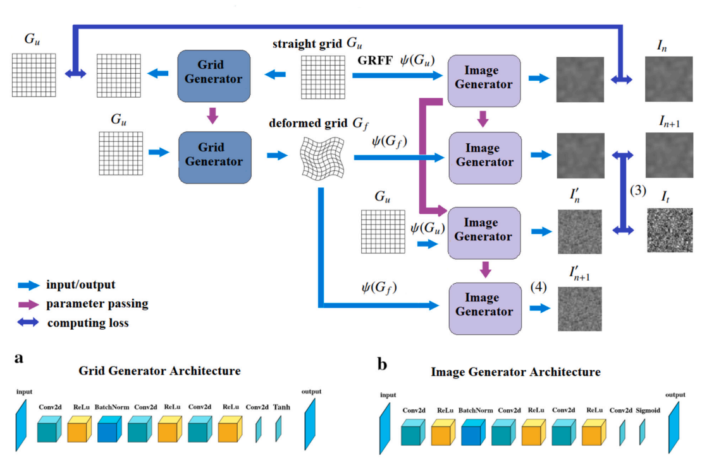

# Unsupervised deep network for image texture transformation: Improving the quality of cross-correlation analysis and mechanical vortex visualisation during cardiac fibrillation

This repository contains materials from the article D.Mangileva "Unsupervised deep network for image texture transformation: Improving the quality of cross-correlation analysis and mechanical vortex visualisation during cardiac fibrillation"
(https://doi.org/10.1016/j.heliyon.2023.e22207)

This study presents a model for image modification aimed at improving the accuracy of displacement field computation using cross‑correlation analysis.

To run on a computer, use PyTorch version >= 1.3.

The folder "Example_of_Images_Vortex_Field(k=3)" contain images with displacement fields of different frequencies. 

- In lines 23 - 25, insert the path to the images;
- In line 27, upload the image 100.png containing Gaussian noise;
- On line 147, set the path for saving the results.

The output images will have a noisy texture with the same displacement field as the input images.

The ready‑to‑use utilities were taken from the work: Li, Nianyi, et al. "Unsupervised non-rigid image distortion removal via grid deformation." Proceedings of the IEEE/CVF International Conference on Computer Vision. 2021. https://github.com/Nianyi-Li/unsupervised-NDIR.git

A detailed description of the research can be found in the article:

Mangileva D. et al. Unsupervised deep network for image texture transformation: Improving the quality of cross-correlation analysis and mechanical vortex visualisation during cardiac fibrillation //Heliyon. – 2023. – Т. 9. – №. 11.

See [references.bib](cite.bib) for BibTeX citations.
